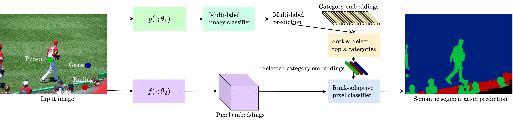

# RankSeg: Adaptive Pixel Classification with Image Category Ranking for Segmentation, ECCV 2022

[](https://arxiv.org/abs/2203.04187)


https://user-images.githubusercontent.com/4639578/193441675-eecf93b0-a869-497b-81c4-ab0b3d210104.mp4


## News

**2022.10.08** ⛽⛽⛽ [MSRA-VC-Group] is hiring research interns to push the frontier cutting-edge technology of object detection and segmentation.⛽⛽⛽ Contact: [yuhui.yuan@microsoft.com](yuhui.yuan@microsoft.com)

**2022.08.20** We release the code of [Mask2Former + RankSeg](mask2former/README.md).

**2022.07.19** We rename MLSeg to RankSeg to highlight the importance of our rank-oriented design.

**2022.07.04** MLSeg has been accepted by ECCV 2022. 


## Introduction
The segmentation task has traditionally been formulated as a complete-label pixel classification task to predict a class for each pixel from a fixed number of predefined semantic categories shared by all images or videos. Yet, following this formulation, standard architectures will inevitably encounter various challenges under more realistic settings where the scope of categories scales up (e.g., beyond the level of 1k). On the other hand, in a typical image or video, only a few categories, i.e., a small subset of the complete label are present. Motivated by this intuition, in this paper, we propose to decompose segmentation into two sub-problems: (i) image-level or video-level multi-label classification and (ii) pixel-level rank-adaptive selected-label classification. Given an input image or video, our framework first conducts multi-label classification over the complete label, then sorts the complete label and selects a small subset according to their class confidence scores. We then use a rank-adaptive pixel classifier to perform the pixel-wise classification over only the selected labels, which uses a set of rank-oriented learnable temperature parameters to adjust the pixel classifications scores. Our approach is conceptually general and can be used to improve various existing
segmentation frameworks by simply using a lightweight multi-label classification head and rank-adaptive pixel classifier. We demonstrate the effectiveness of our framework with competitive experimental results across four tasks, including image semantic segmentation, image panoptic segmentation, video instance segmentation, and video semantic segmentation. Especially, with our RankSeg, Mask$2$Former gains +0.8%/+0.7%/+0.7% on ADE$20$K panoptic segmentation/YouTubeVIS 2019 video instance segmentation/VSPW video semantic segmentation benchmarks respectively.


- The RankSeg architecture:



## Image Semantic & Image Panoptic & Video Semantic & Video Instance Segmentation based on Mask2Former +  RankSeg
### Semantic Segmentation
See the [MODEL_ZOO](mask2former/MODEL_ZOO.md) for Mask2Former.

## Image Semantic Segmentation based on DeepLabV3/Segmenter/Swin/BEiT + RankSeg

### RankSeg + DeepLabV3

| Method | Dataset | Backbone | Crop Size | Lr schd |  mIoU | mIoU(ms+flip) | config | download |
|:---|:---:|:---:|:---:|:---:|:---:|:---:|:---:|:---:|
| DeepLabV3 (Official) | COCO-Stuff | R101 | 512x512 | 20000 | 37.3 | 38.4 | - | -
| DeepLabV3 + RankSeg | COCO-Stuff | R101 | 512x512 | 20000 | 38.4 | 39.8 | - | -
| DeepLabV3 (Official) | ADE20K | R101 | 512x512 | 80000 | 44.1 | 45.2 | - | -
| DeepLabV3 + RankSeg | ADE20K | R101 | 512x512 | 80000 | 45.5 | 46.6 | - | -
| DeepLabV3 | COCO+LVIS | R101 | 512x512 | 160000 | 11.0 | - | - | -
| DeepLabV3 + RankSeg | COCO+LVIS | R101 | 512x512 | 160000 | 12.8 | - | - | -


### RankSeg + Segmenter

* Multi-Scale test is not conducted on ADE20KFull and COCO+LVIS datasets because of memory limits.

| Method | Dataset | Backbone | Crop Size | Lr schd |  mIoU | mIoU(ms+flip) | config | download |
|:---|:---:|:---:|:---:|:---:|:---:|:---:|:---:|:---:|
| Segmenter | COCO-Stuff | ViT-B | 512x512 | 40000 | 41.9 | 43.8 |- | -
| Segmenter + RankSeg | COCO-Stuff | ViT-B | 512x512 | 40000 | 44.9 | 46.2 | - | -
| Segmenter | COCO-Stuff | ViT-B | 512x512 | 80000 | 43.4 | 45.2 | - | -
| Segmenter + RankSeg | COCO-Stuff | ViT-B | 512x512 | 80000 | 45.7 | 46.7 | - | -
| Segmenter | COCO-Stuff | ViT-L | 640x640 | 40000 | 45.5 | 47.1 | - | -
| Segmenter + RankSeg | COCO-Stuff | ViT-B | 640x640 | 40000 | 46.7 | 47.9 | - | -
| Segmenter | Pascal-Context60 | ViT-B | 480x480 | 80000 | 53.8 | 54.6 | - | -
| Segmenter + RankSeg | Pascal-Context60 | ViT-B | 480x480 | 80000 | 54.7 | 55.4 | - | - 
| Segmenter | ADE20K | ViT-B | 512x512 | 160000 | 48.8 | 50.7 | - | -
| Segmenter + RankSeg | ADE20K | ViT-B | 512x512 | 160000 | 49.7 | 51.4 | - | -
| Segmenter | ADE20K | ViT-L | 640x640 | 160000 | 52.0 | 53.6 | - | -
| Segmenter + RankSeg | ADE20K | ViT-L | 640x640 | 160000 | 52.6 | 54.4 | - | -
| Segmenter | ADE20KFull | ViT-B | 512x512 | 160000 | 17.8 | - | - | -
| Segmenter + RankSeg | ADE20KFull | ViT-B | 512x512 | 160000 | 18.8 | - | - | -
| Segmenter | COCO+LVIS | ViT-B | 512x512 | 320000 | 19.4 | - | - | -
| Segmenter + RankSeg | COCO+LVIS | ViT-B | 512x512 | 320000 | 21.3 | - | - | -
| Segmenter | COCO+LVIS | ViT-B | 640x640 | 320000 | 23.7 | - | - | -
| Segmenter + RankSeg | COCO+LVIS | ViT-B | 640x640 | 320000 | 24.6 | - | - | -

### RankSeg + Swin

| Method | Dataset | Backbone | Crop Size | Lr schd |  mIoU | mIoU(ms+flip) | config | download |
|:---|:---:|:---:|:---:|:---:|:---:|:---:|:---:|:---:|
| Swin | COCO-Stuff | Swin-B | 512x512 | 40000 | 45.7 | 47.2 | - | -
| Swin + RankSeg | COCO-Stuff | Swin-B | 512x512 | 40000 | 46.6 | 47.9 | - | -
| Swin (Official) | ADE20K | Swin-B | 512x512 | 160000 | 50.8 | 52.4 | - |-
| Swin + RankSeg | ADE20K | Swin-B | 512x512 | 160000 | 51.4 | 53.0 | - | -
| Swin | COCO+LVIS | Swin-B | 512x512 | 160000 | 20.3 | - | - | -
| Swin + RankSeg | COCO+LVIS | Swin-B | 512x512 | 160000 | 20.8 | - | - | -

### RankSeg + BEiT

| Method | Dataset | Backbone | Crop Size | Lr schd |  mIoU | mIoU(ms+flip) | config | download |
|:---:|:---:|:---:|:---:|:---:|:---:|:---:|:---:|:---:|
| BEiT (Official) | ADE20K | BEiT-L | 640x640 | 160000 | 56.7 | 57.0 | - | -
| RankSeg + BEiT | ADE20K | BEiT-L | 640x640 | 160000 | 57.0 | 57.8| - | -
| BEiT (Official) | COCO-Stuff | BEiT-L | 640x640 | 160000 | 49.7 | 49.9 | - | -
| RankSeg + BEiT | COCO-Stuff | BEiT-L | 640x640 | 160000 | 49.9 | 50.3| - | -

## Image Semantic & Panoptic Segmentation based on MaskFormer +  RankSeg

### Semantic Segmentation
| Method | Dataset | Backbone | Crop Size | Lr schd |  mIoU | mIoU(ms+flip) | config | download |
|:---|:---:|:---:|:---:|:---:|:---:|:---:|:---:|:---:|
| MaskFormer | ADE20K | Swin-B | 512x512 | 160000 | 52.7 | 53.9 | - | -
| MaskFormer + RankSeg | ADE20K | Swin-B | 512x512 | 160000 | 53.9 | 55.1 | - | -

### Panoptic Segmentation
| Method | Dataset | Backbone | Crop Size | Lr schd | PQ | PQ-th | PQ-st | RQ | RQ-th | RQ-st | SQ | SQ-th | SQ-st | config | download |
|:---|:---:|:---:|:---:|:---:|:---:|:---:|:---:|:---:|:---:|:---:|:---:|:---:|:---:|:---:|:---:|
| MaskFormer | ADE20K | R50 | 640x640 | 720000 | 34.7 | 32.2 | 39.7 | 42.8 | 40.1 | 48.1 | 76.7 | 76.9 | 76.3 | - | -
| MaskFormer + RankSeg | ADE20K | R50 | 640x640 | 720000 | 36.5 | 34.5 | 40.6 | 44.9 | 42.8 | 48.9 | 76.8 | 77.1 | 76.0 | - | -
| MaskFormer + RankSeg + GT| ADE20K | R50 | 640x640 | 720000 | 44.3 | 39.7 | 53.5 | 54.5 | 49.5 | 64.6 | 79.6 | 78.6 | 81.7 | - | -


## Citation

If you find this project useful in your research, please consider cite:

```
@article{he2022mlseg,
  title={MLSeg: Image and Video Segmentation as Multi-Label Classification and Selected-Label Pixel Classification},
  author={He, Haodi and Yuan, Yuhui and Yue, Xiangyu and Hu, Han},
  journal={arXiv preprint arXiv:2203.04187},
  year={2022}
}
```


```
git diff-index HEAD
git subtree add -P pose <url to sub-repo> <sub-repo branch>
```
>>>>>>> fa938790cb87b5d6115d7d0a45fbe1f787506b1d
